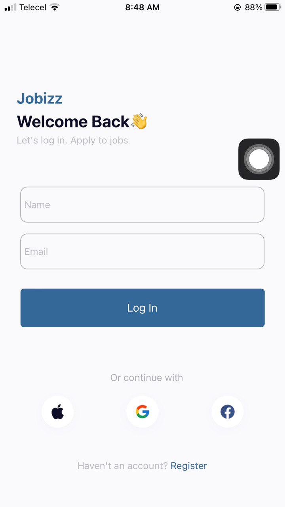
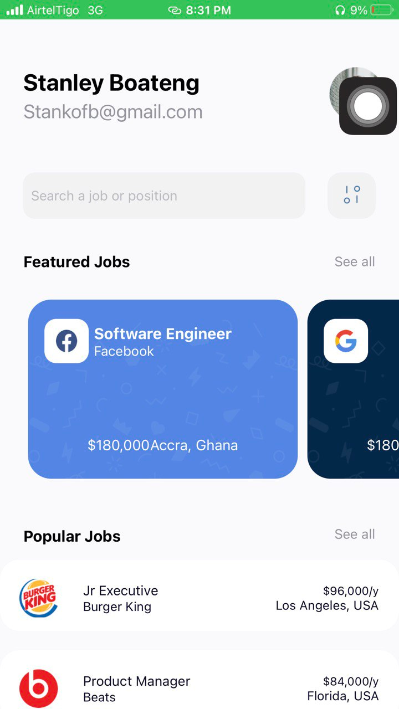

### What does this project do?
This project is a mobile application built using React Native. qq`serves as a platform for displaying job listings or related content. The app seems to have screens for home and login, as well as components for featured and popular jobs.

### Why does this project exist?
The project exists to fulfill the requirements of assignment 4, possibly for a course or a learning exercise. It aims to showcase the ability to create a mobile application using React Native and integrate various features like navigation and UI components.

### Main technologies, frameworks, languages used:
- **React Native**: Used for building the mobile application.
- **Expo**: Development environment and toolchain for React Native applications.
- **React Navigation**: Library for routing and navigation in React Native apps.
- **React Native Vector Icons**: For using vector icons in the application.
- **Babel**: JavaScript compiler for transforming code.

### Codebase organization:
- **App.js**: Main entry point of the application.
- **app.json**: Configuration file for the app.
- **assets/**: Directory containing various image assets used in the app.
- **components/**: Directory containing reusable components like FeaturedJobs and PopularJobs.
- **homeScreen.js**: File representing the home screen of the app.
- **loginScreen.js**: File representing the login screen of the app.
- **babel.config.js**: Babel configuration file.
- **package-lock.json**: Auto-generated file for npm dependencies.
- **package.json**: File containing project metadata and dependencies.
- **.gitignore**: File specifying which files and directories to ignore in version control.

### Scripts:
- **start**: Command to start the development server.
- **android**: Command to start the app on an Android emulator or device.
- **ios**: Command to start the app on an iOS simulator or device.
- **web**: Command to start the app in a web browser.

Overall, this project is a React Native mobile application for displaying job listings, built with various technologies and organized into screens and components.

## Screenshots

